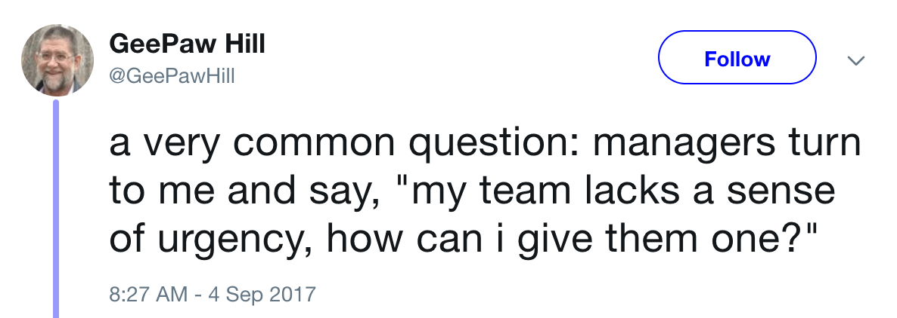

# Building Effective Teams of Competent, Friendly People

---

# Chris Koeberle
# Bottle Rocket 
### @kodi
Lead developer on Android apps for:

* Starwood Hotels
* Major U.S. Airline
* Animal Supply Company

---

# Leadership Roles

* Project Manager
* Product Owner
* HR Manager
* Architect
* Tech lead

Lots of resources for other roles, but it's difficult to find information narrowly targeted to  how to lead a team of developers.

---

# Friendly?
### More like "not unfriendly"
Not a high standard, simply the capacity for kindness and empathy. Can a person be happy for their team members when things go well for them, and be understanding when things go badly?

---

# Competent?
### At least, "not incompetent"
Can the developer do their job as described? If you give them an environment where they have the tools they need to succeed, will they? Again, this is just the bare minimum to function independently for some period of time.

---

# Better than an empty desk?
### Things an empty desk can't do:
* Make its coworkers angry
* Write really embarassing bugs
* Improve!

---

# This is the foundation
### What if you don't have this foundation?
If you have one dysfunctional team member, try to contain them. Envelope them in kindness and watch them closely while you try to move them off the project.

If most of your team is incompetent or unfriendly, and you're actually achieving something, I'm very interested in attending your talk!

---

* Rhythm
* Autonomy
* Mastery
* Purpose
* Safety

---

# Rhythm
### It's vital to have periods of activty and periods of rest.
Never-ending crunchtime is awful. Never-ending downtime is also terrible in its own way.

---

# Autonomy
### Most importantly, we respect people as authorities within their domains of practice.
Autonomy can be constrained! 

---

# Mastery
### Everyone on a team should have a vision of a better version of themselves, and a clear idea of how the work they're doing now is helping them approach that vision.
These facets are interconnected - you can see how rhythm and autonomy can both be used to help people feel like they're accomplishing this goal.

---

# Purpose
### This is what most people think of as "motivation." This is the bare idea that we have a common purpose.
This is necessary but not sufficient. If it's missing, then nothing else matters. If it's there, then the other facets become much more important.

---

# Safety
### The freedom to be different, even wrong, even permanently.

There are many casual ways we erode the safety of the people around us without thinking about it. Demanding that people assert their own need for safety also lessens the feeling of safety. This is something that has to be assertively pursued and inquired after.

---

# Freedom to fail

Junior developers are a tremendous resource, but they need room to grow. I picture myself as a very broad safety net, far enough away to seem invisible. 

Everyone on the team needs to know that if something goes wrong, the whole team will be there to help them recover from it.

---

# The Safety Net

* Code reviews
* Automated tests
* Quality Assurance
* Lots of good examples in the repo
* ZERO bad examples in the repo
* Consistent architecture

---

# Boundaries

Everything we do in Android offers us a number of options - frameworks, libraries, patterns, code styles; even the Android SDK often offers multiple ways to do the same thing. 

Expect resistance to the idea that everything in the repo must be done the same way, and proactively disarm that resistance. If we're using a tool, it's because that tool makes our lives easier. Having to make a choice over and over again destroys that.

---

# Something Went Wrong

### Nobody goes to work intending to do a bad job

With every team, you have to build an environment where everyone feels free to assess problems with the software without worrying that someone will feel personally attacked.

Negotiate toward a communication strategy that fits the team. Some developers are very comfortable with criticism, others are not - must support the least comfortable.

---

# Urgency

### Nothing can be urgent for a whole week

Sometimes it's important to have some performative urgency to help people see that the team takes something very, very seriously. But when things are truly urgent, the most important thing is to give the people actually resolving the problem the ability to opt in and out of communication.

---

# Sources

Dekker, Sidney. The Field Guide to Understanding Human Error. 2017.

https://bit.ly/cdk-ramps

https://bit.ly/cdk-effective-pres
